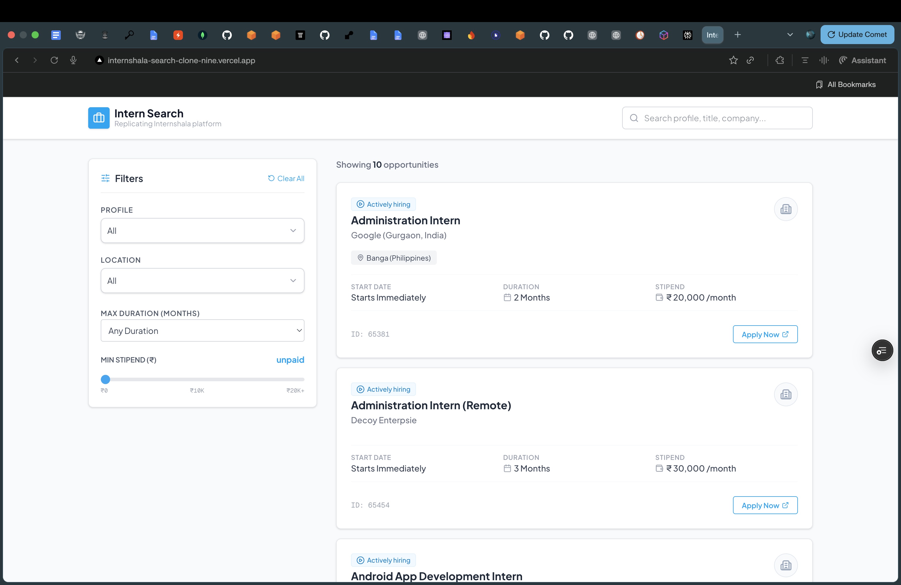
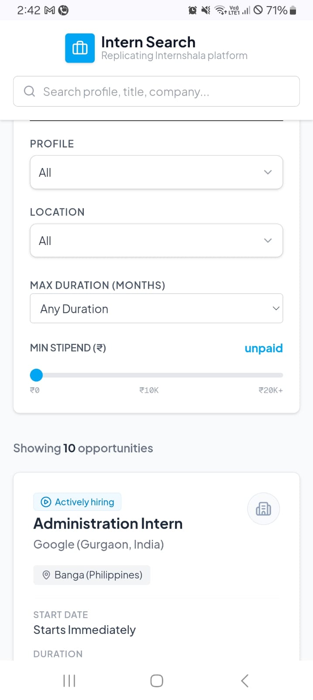

# Internshala Clone

A modular, highly responsive search and discovery page replication of the Internshala internship platform. This application allows candidates to browse, search, and filter internships using multi-parameter selectors that synchronize state directly with URL parameters for a bookmarkable and modern search experience.

---

## 🔗 Live Demo & Repository

- **Hosted Link**: [https://internshala-search-clone-nine.vercel.app/](https://internshala-search-clone-nine.vercel.app/)
- **GitHub Repository**: [https://github.com/AKASHDHARDUBEY/internshala-search-clone.git](https://github.com/AKASHDHARDUBEY/internshala-search-clone.git)

---

## ✨ Features

- **Multi-Parameter Filter Panel**: Filter by Profile, Location, Max Duration (1 to 6 months), and Minimum Stipend.
- **Searchable Dropdown Selectors**: Reusable selection components for Profile and Location filters featuring search filtering and mousedown click-away listeners.
- **URL Synchronization**: Real-time query parameter synchronization to persist filter states across page reloads.
- **Dynamic Result Count Summary**: Natural, grammatically correct search summaries (e.g. *Showing 1 opportunity in Gurgaon*).
- **Subtle Interactions**: Smooth cards entry transition (staggered delay) and hover elevations (`y: -4` translation) built with Framer Motion.
- **Responsiveness**: Responsive viewport handling (stacked list details on mobile screens to prevent text overlap).

---

## 🛠️ Tech Stack

- **Core**: Next.js 15+ (App Router, React 19)
- **Language**: TypeScript (Strict Mode)
- **Styling**: Tailwind CSS
- **HTTP Client**: Axios
- **Animations**: Framer Motion
- **Icons**: Lucide React

---

## ⚙️ Architecture

- **URL-First State Model**: Synchronizes search terms and filters directly to the browser query parameters.
- **API Proxy Routing**: Standardized request routing through a serverless route (`/api/internships`) to circumvent potential CORS restrictions, with fallback configurations if downstream systems fail.
- **TypeScript Type Safety**: Built-in compiler validation on data models, API schemas, and react hook definitions.

---

## 📁 Folder Structure

```text
src/
├── app/
│   ├── api/
│   │   └── internships/
│   │       └── route.ts         # Proxy API route handler
│   ├── globals.css              # Custom layout bindings and Tailwind layers
│   ├── layout.tsx               # Next.js Root Layout with loaded Outfit fonts
│   └── page.tsx                 # Core Dashboard layout wrapper with Suspense boundaries
├── components/
│   ├── FilterBar/
│   │   └── FilterBar.tsx        # Filter selection panel
│   ├── InternshipCard/
│   │   └── InternshipCard.tsx   # Individual listing card with hover transitions
│   ├── InternshipList/
│   │   └── InternshipList.tsx   # Stagger-animated listing container
│   └── UI/
│       ├── EmptyState.tsx       # Search fallback view
│       ├── LoadingSkeleton.tsx  # Shimmer load states
│       └── SearchableSelect.tsx # Custom searchable dropdown component
├── hooks/
│   └── useInternships.ts        # Custom state and URL parameter hook
├── services/
│   └── internshipApi.ts         # Axios client setup
├── types/
│   └── internship.ts            # Type definitions
└── utils/
    └── filterHelpers.ts         # Case-insensitive filtering and range rules
```

---

## ⚡ Setup Instructions

1. **Clone the Repository**:
   ```bash
   git clone https://github.com/AKASHDHARDUBEY/internshala-search-clone.git
   cd internshala-search-clone
   ```

2. **Install Dependencies**:
   ```bash
   npm install
   ```

3. **Run the Development Server**:
   ```bash
   npm run dev
   ```

4. **Verify Lints & Build**:
   ```bash
   npm run lint
   npm run build
   ```

---

## 🚀 Deployment

The project is configured for cloud deployment on Vercel. Continuous integration automatically triggers builds and deploys upon commits to the `main` branch.

---

## 📸 Screenshots

### Desktop View


### Mobile View


---

## 🔮 Future Improvements

- **Pagination & Infinite Scroll**: Implementing lazy loading for data sets exceeding 100 listings.
- **Saved Searches**: Providing options to bookmark configurations locally in local storage.
- **Auth Integrations**: Enabling recruiter-side profiles and student-profile matching.
